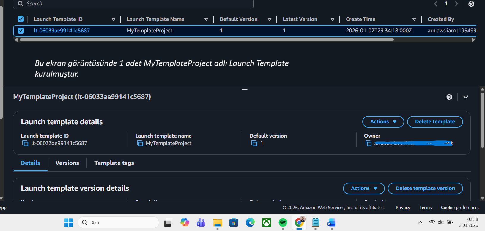

# AWS-EC2-Auto-Scaling-Self-Healing-Web-Server
Bu proje, AWS üzerinde Yüksek Erişilebilirlik (High Availability) ve Hata Toleransı (Fault Tolerance) kavramlarını uygulamalı olarak göstermek için oluşturulmuştur.

##  Proje Özeti
Bu çalışmada, bir sunucu çökse veya silinse bile AWS'nin otomatik olarak yeni bir sunucu ayağa kaldırdığı bir altyapı kurulmuştur.

##  Kullanılan AWS Servisleri
- **EC2 (Elastic Compute Cloud):** Web sunucusu olarak kullanıldı.
- **Launch Template:** Sunucu konfigürasyonu (t2.micro, Amazon Linux 2023) tanımlandı.
- **Auto Scaling Group (ASG):** Sunucu sayısının her zaman en az 1 olmasını denetledi.
- **VPC & Subnets:** Sistemin farklı Availability Zone'larda çalışması sağlandı.

##  Kurulum Adımları
1. `install_webserver.sh` dosyasındaki script, Launch Template oluşturulurken **User Data** kısmına eklendi.
2. Auto Scaling Group ayarlarında "Desired Capacity" 1 olarak belirlendi.
3. Test için çalışan sunucu manuel olarak sonlandırıldı (Terminate) ve ASG'nin yeni bir sunucu başlattığı gözlemlendi.

##  Maliyet Analizi (FinOps)
Bu projenin tamamı **AWS Free Tier** limitleri dahilindedir:
- EC2 t2.micro (750 saat/ay ücretsiz)
- Launch Template & ASG (Ücretsiz servisler)

 Ekran Görüntüsü

